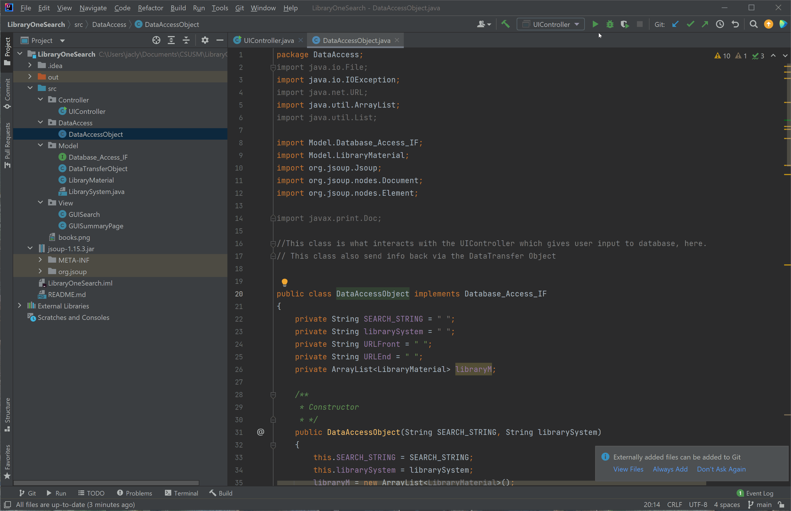

# LibraryOneSearch
Library OneSearch aims to be a search engine for literature amongst public library systems in San Diego. There are other search engines, like MiraCosta’s Library OneSearch, that search for literature but only within the limits of their organization. The new system would provide a convenience to the user, allowing them to find all of the possible locations for their searched book, newspaper article, textbook, audiobook, or paperback. After checking all library databases for literature material of the users choosing, the search result would display a small summary, status of the book (if it’s available/unavailable), and the location of the book.

With Library OneSearch, a desktop Java application,  users can enter their desired text name or ISBN number into the interface. The backend uses this data to search publicly available library catalogs for the text. This is done using web drivers and a web scraping bot to navigate the library websites and collect the data each library has about the user’s text. This data is aggregated, organized, and displayed to the user, summarizing which libraries have their specific text. Library OneSearch will help users save time by showing them library material availability in their local San Diego area with a single search.

## System Demo
 / ! 

